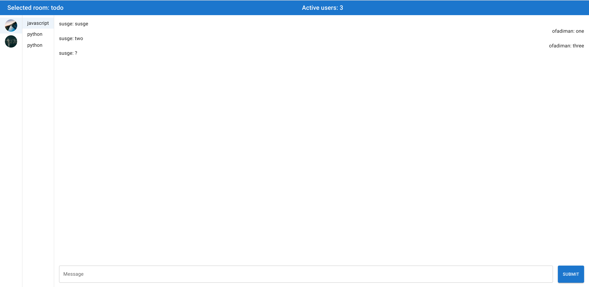

# SocketIO

SocketIO is a project that was created to learn [socket.io](https://socket.io/) technology. The repository contains several smaller applications demonstrating the capabilities of the `socket.io` library.

## Slack

The `slack` folder contains a project, which is a chat application allowing users to send messages in real time.

