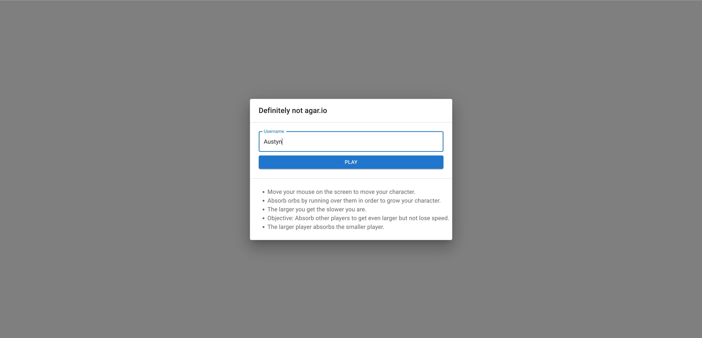
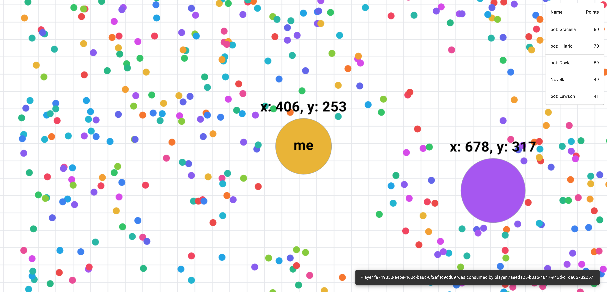

# Definitely NOT agar.io

Agar.io is a massive multiplayer online action game. Players control one or more circular cells in a map representing a Petri dish. The goal is to gain as much mass as possible by eating cells and player cells smaller than the player's cell while avoiding larger ones which can eat the player's cells. The name comes from the substance agar, used to culture bacteria.

## Implemented functionalities

- Moving around the canvas.
- Consuming orbs.
- Consuming other players.
- Bots playing alongside real players.
- Screen zooming based on the mass owned.
- Player slowdown based on the owned mass.

## Gameplay

The objective of the game is to become the largest cell on the server. Players move their cell using mouse controls or keyboard keys, allowing for fluid and responsive movement within the game environment. As players consume smaller cells and pellets, their cell grows in size, making it easier to consume larger cells while also becoming a more tempting target for other players.

The gameplay mechanics are straightforward but offer a surprising amount of depth and strategy. Players must constantly balance aggression with caution, as overly aggressive moves can leave them vulnerable to being eaten by larger cells, while overly cautious play may result in missed opportunities for growth.

